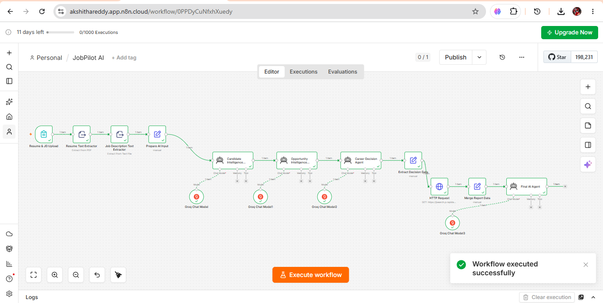
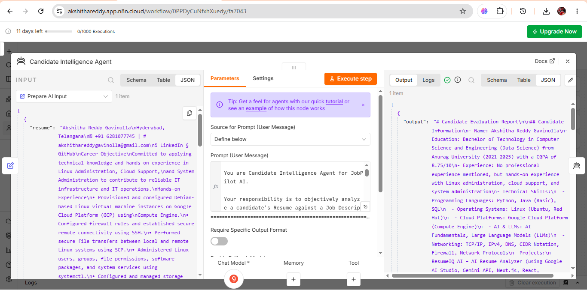
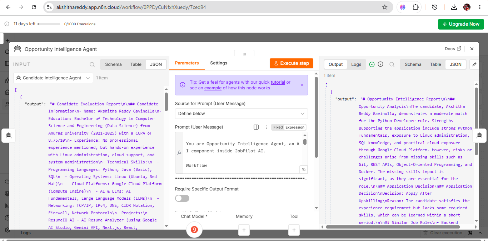
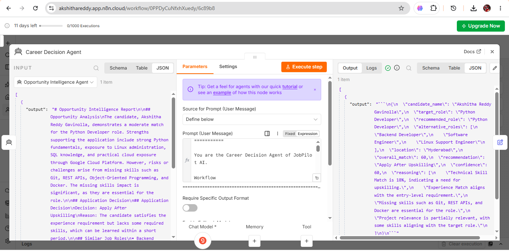
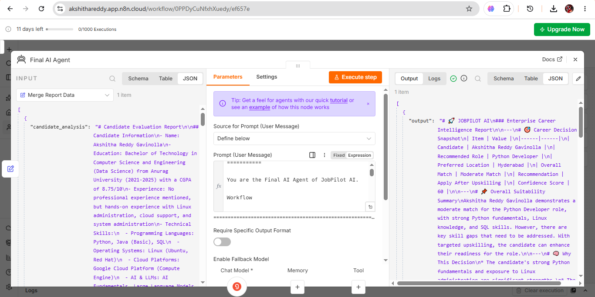

# 🚀 JobPilot AI – Multi-Agent Career Intelligence System


---

## 📌 Project Overview

JobPilot AI is a **Multi-Agent Career Intelligence System** built using **n8n**, **Groq Llama 3.3 70B**, **Prompt Engineering**, and **REST APIs**.

The system helps candidates evaluate their resumes against a job description, identify skill gaps, receive personalized career guidance, and discover relevant live job opportunities.

Instead of relying on a single AI prompt, the workflow is divided into multiple specialized AI agents, where each agent performs a dedicated responsibility. This modular architecture improves maintainability, scalability, and makes the workflow easier to extend.

---

## 🎥 Demo

This project demonstrates an end-to-end AI-powered career intelligence workflow that:

- Analyzes resumes
- Evaluates job descriptions
- Identifies skill gaps
- Recommends suitable career paths
- Retrieves live job opportunities
- Generates a comprehensive Career Intelligence Report

---

## ✨ Key Features

- 📄 Resume Analysis
- 📋 Job Description Analysis
- 🤖 Multi-Agent AI Workflow
- 🎯 Skill Gap Identification
- 💼 Career Recommendations
- 🌐 Live Job Search Integration
- 📊 Career Intelligence Report Generation
- 🔗 REST API Integration
- ⚡ Workflow Automation using n8n

---

## 🛠️ Tech Stack

| Technology | Purpose |
|------------|---------|
| n8n | Workflow Automation |
| Groq Llama 3.3 70B | Large Language Model |
| Prompt Engineering | AI Agent Instructions |
| REST API | Live Job Search |
| JSON | Data Exchange |
| HTTP Request | API Communication |

---

## 💡 Skills Demonstrated

- Multi-Agent AI Workflow Design
- Prompt Engineering
- Workflow Automation
- REST API Integration
- JSON Data Processing
- AI Application Development
- Modular Workflow Design
- System Integration

---

## 🏗️ Workflow Architecture

The workflow follows a modular architecture where each AI agent is responsible for a single task.

1. Resume Upload
2. Job Description Upload
3. Resume Text Extraction
4. Job Description Text Extraction
5. Prepare AI Input
6. Candidate Intelligence Agent
7. Opportunity Intelligence Agent
8. Career Decision Agent
9. Extract Decision Data
10. HTTP Request (Job Search API)
11. Merge Report Data
12. Final AI Agent
13. Career Intelligence Report

---

## 📷 Workflow Overview



---

# 🤖 AI Agents

## 1️⃣ Candidate Intelligence Agent

### Purpose

Analyzes the candidate's resume against the uploaded job description.

### Responsibilities

- Resume Analysis
- Skill Matching
- Skill Gap Identification
- Candidate Strengths
- Learning Recommendations

### Screenshot



---

## 2️⃣ Opportunity Intelligence Agent

### Purpose

Evaluates the candidate's career opportunities based on the previous AI analysis.

### Responsibilities

- Career Evaluation
- Suitable Role Recommendation
- Career Guidance
- Opportunity Analysis

### Screenshot



---

## 3️⃣ Career Decision Agent

### Purpose

Generates a structured career decision for downstream processing.

### Responsibilities

- Recommended Role
- Overall Match Score
- Confidence Score
- Recommendation
- Decision Reasoning

### Screenshot



---

## 🌐 External API Integration

After the Career Decision Agent recommends the most suitable role, the workflow extracts the required decision data and sends it to an external Job Search API using an HTTP Request node.

The API retrieves live job opportunities matching the recommended role, enabling dynamic and real-time career recommendations.

---

## 📊 Final Career Intelligence Report

The Final AI Agent combines:

- Candidate Intelligence
- Opportunity Intelligence
- Career Decision
- Live Job Opportunities

into a single Career Intelligence Report.

### Screenshot



---

## 📁 Project Structure

```text
JobPilot-AI/
│
├── README.md
│
├── docs/
│   ├── workflow-overview.png
│   ├── candidate-agent.png
│   ├── opportunity-agent.png
│   ├── career-decision-agent.png
│   └── final-report.png
│
├── workflow/
│   └── jobpilot-workflow.json
│
└── prompts/
```

---

## 🚀 Future Enhancements

- ATS Resume Score Prediction
- Resume Optimization Suggestions
- Cover Letter Generator
- Interview Question Generator
- Personalized Learning Roadmap
- Recruiter Dashboard
- Email Notifications
- Multi-language Support

---

## 🎯 Key Learnings

Through this project, I gained hands-on experience in:

- Multi-Agent AI Workflow Design
- Prompt Engineering
- Workflow Automation using n8n
- REST API Integration
- AI-Oriented System Design
- JSON Data Processing
- Modular Application Development

---

## 🙏 Acknowledgements

This project was developed as part of my AI and Workflow Automation learning journey to demonstrate the practical implementation of multi-agent AI systems using n8n, LLMs, and REST APIs.

---

## 👩‍💻 Author

**Akshitha Reddy Gavinolla**

B.Tech – Computer Science Engineering (Data Science)

GitHub: https://github.com/akshithareddy-star

LinkedIn: https://www.linkedin.com/in/akshitha-reddy-gavinolla/